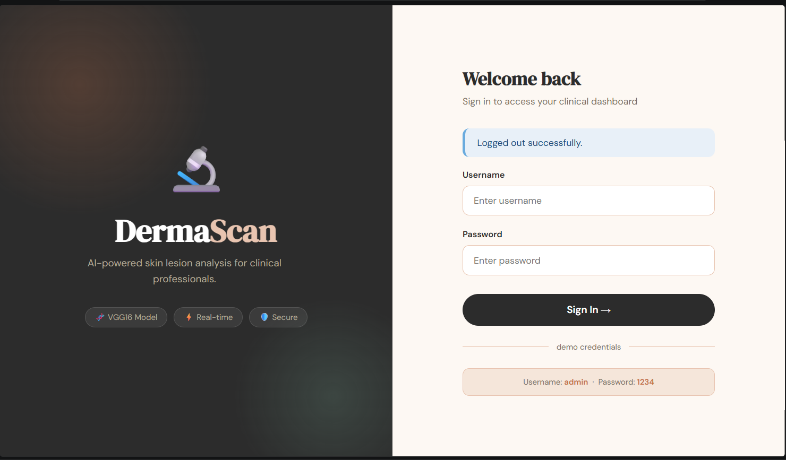
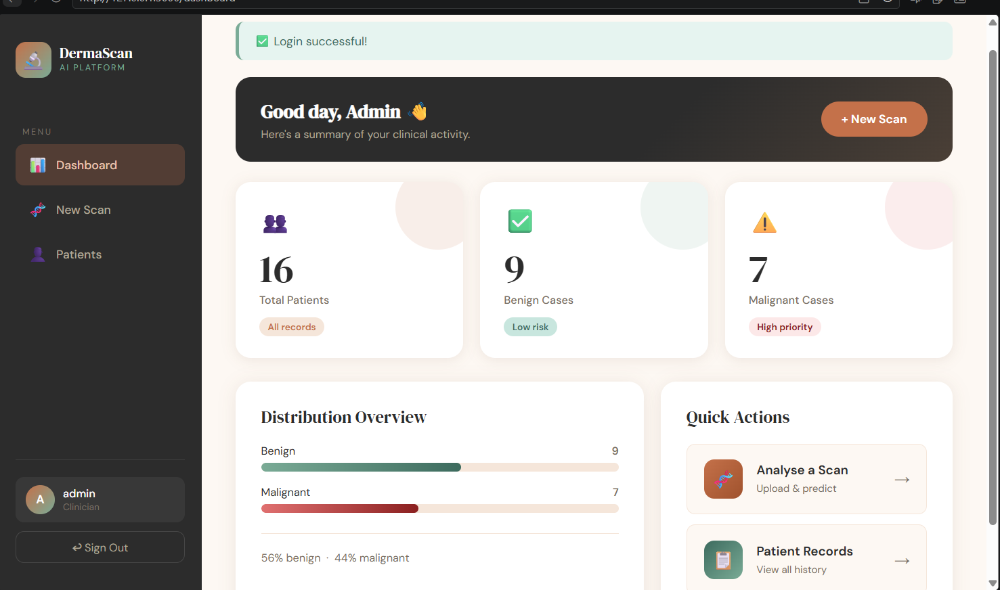
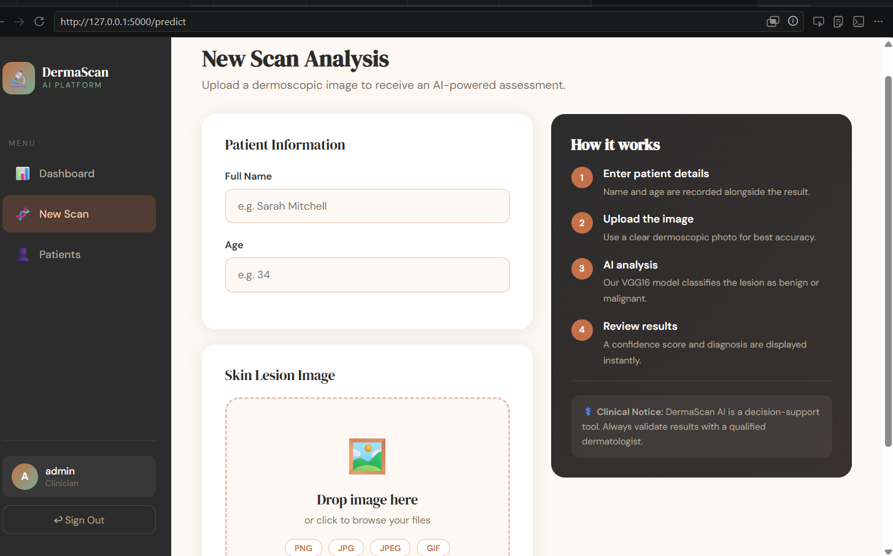
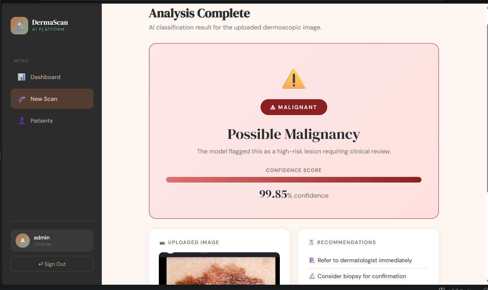
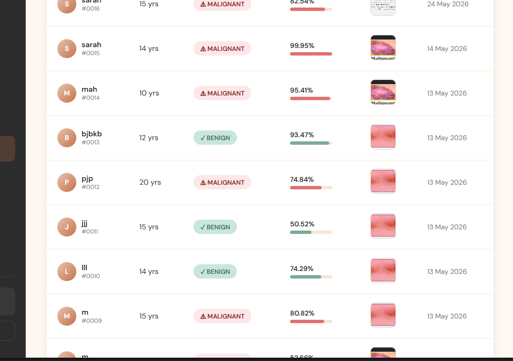

#  DermaScan — Skin Cancer Detection Web App

> An AI-powered web application that classifies skin lesion images as **Malignant** or **Benign** using a VGG16 deep learning model. Built with Flask, MySQL, and TensorFlow/Keras.

---

##  Screenshots

> **Note:** Replace the placeholder paths below with your actual screenshot files once you capture them from your running app. Place them in a `screenshots/` folder in your repository.

###  Login Page

*Simple and secure login interface for medical staff*

###  Dashboard

*Overview of total patients, benign cases, and malignant cases*

###  Prediction Page

*Upload a skin lesion image along with patient info to get an instant AI diagnosis*

###  Result Page

*Clear display of the diagnosis result with confidence percentage*

###  Patient Records

*Full list of all analyzed patients with their results and uploaded images*

---

##  Features

- **AI-powered diagnosis** using a fine-tuned VGG16 model trained on skin lesion images
- **User authentication** with session management
- **Patient records management** — store and review all past diagnoses
- **Image upload** with format validation (PNG, JPG, JPEG, GIF)
- **Confidence score** displayed alongside each diagnosis
- **Dashboard statistics** with live counts of total, benign, and malignant cases
- **Fallback mock predictions** when the model file is unavailable (useful for testing)

---

##  Tech Stack

| Layer | Technology |
|-------|-----------|
| Backend | Python 3, Flask |
| AI / ML | TensorFlow, Keras, VGG16 |
| Database | MySQL |
| Frontend | HTML, CSS, Jinja2 templates |
| File handling | Werkzeug, UUID |

---

##  Project Structure

```
dermascan/
├── app.py                  # Main Flask application
├── database.sql            # Database schema and seed data
├── model/
│   └── vgg16_malignant_vs_benign.h5   # Trained Keras model
├── static/
│   └── uploads/            # Uploaded patient images
├── template/
│   ├── login.html
│   ├── dashboard.html
│   ├── predict.html
│   ├── results.html
│   └── patients.html
└── screenshots/            # App screenshots (for README)
```

---

##  Installation & Setup

### 1. Clone the repository

```bash
git clone https://github.com/YOUR_USERNAME/dermascan.git
cd dermascan
```

### 2. Create a virtual environment

```bash
python -m venv venv
source venv/bin/activate        # On Windows: venv\Scripts\activate
```

### 3. Install dependencies

```bash
pip install flask mysql-connector-python tensorflow werkzeug numpy
```

### 4. Set up the database

```bash
mysql -u root -p < database.sql
```

This creates the `skin_cancer_db` database with:
- `users` table (with a default admin account)
- `patients` table for storing diagnosis records

**Default credentials:**
| Username | Password |
|----------|----------|
| `admin`  | `1234`   |

>  Change these credentials before deploying to production.

### 5. Add the trained model

Place your trained model file at:
```
model/vgg16_malignant_vs_benign.h5
```

> If the model is not present, the app will fall back to **random mock predictions** for testing purposes.

### 6. Run the application

```bash
python app.py
```

Visit `http://127.0.0.1:5000` in your browser.

---

##  How the AI Model Works

1. The uploaded image is resized to **224×224 pixels** (VGG16 input size)
2. Pixel values are normalized to the range `[0, 1]`
3. The model outputs a **probability score between 0 and 1**
4. If the score is **> 0.5** → classified as **MALIGNANT**
5. If the score is **≤ 0.5** → classified as **BENIGN**
6. The **confidence percentage** is derived from the probability relative to the predicted class

---

##  Security Notes

> This project is intended as an educational prototype. Before any real-world or public deployment, address the following:

- [ ] Replace the `app.secret_key` with a strong random key (use `secrets.token_hex(32)`)
- [ ] Hash passwords using `bcrypt` or `werkzeug.security` — **never store plain-text passwords**
- [ ] Use environment variables for all credentials (DB password, secret key)
- [ ] Enable HTTPS
- [ ] Add input sanitization to prevent SQL injection beyond parameterized queries
- [ ] Restrict file upload size and add deeper file type validation

---

##  Known Limitations

- Passwords are stored in plain text in the current database schema
- The model path is hardcoded — consider making it configurable via environment variables
- No pagination on the patients list (may be slow with large datasets)
- The app runs in **debug mode** by default — disable for production

---

##  License

This project is open source and available under the [MIT License](LICENSE).

---

##  Acknowledgements

- [VGG16 Architecture](https://arxiv.org/abs/1409.1556) — Simonyan & Zisserman
- [ISIC Dataset](https://www.isic-archive.com/) — for skin lesion training data
- [Flask Documentation](https://flask.palletsprojects.com/)
- [TensorFlow / Keras](https://www.tensorflow.org/)
